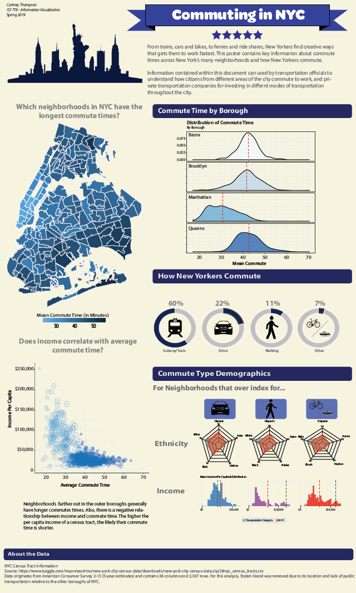

# IST 719 - Information Visualization
**Student:** Cartney Thompson  
**Program/School:** Applied Data Science - Syracuse University - School of Information Studies  
**e-mail:** cdthomps@syr.edu

## Project Description
We all know that commuting in New York City is a pain. This poster highlights the neighborhoods that have the longest commute times as well as how New Yorker's commute to work. From the analysis, I came across the following conclustions:
- Residents in the outer Boroughs have the longest commute (no surprise here).
- In NYC, there is a strong inverse relationship between commute time and average income per capita
- Most New Yorkers commute by Subway
- New Yorkers that walk, bike, or take the ferry to work, on average, tend to have higher incomes than the average New Yorker

## Poster Overview

## Required Tools
R, Adobe Illustrator
